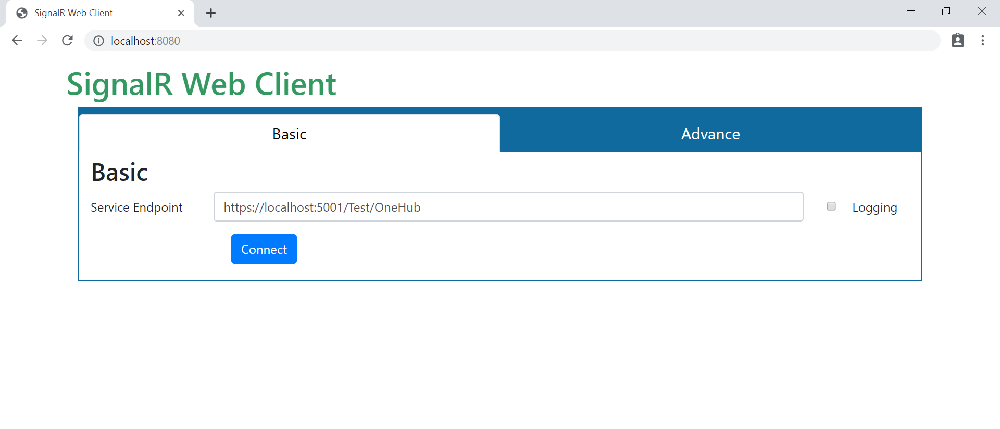
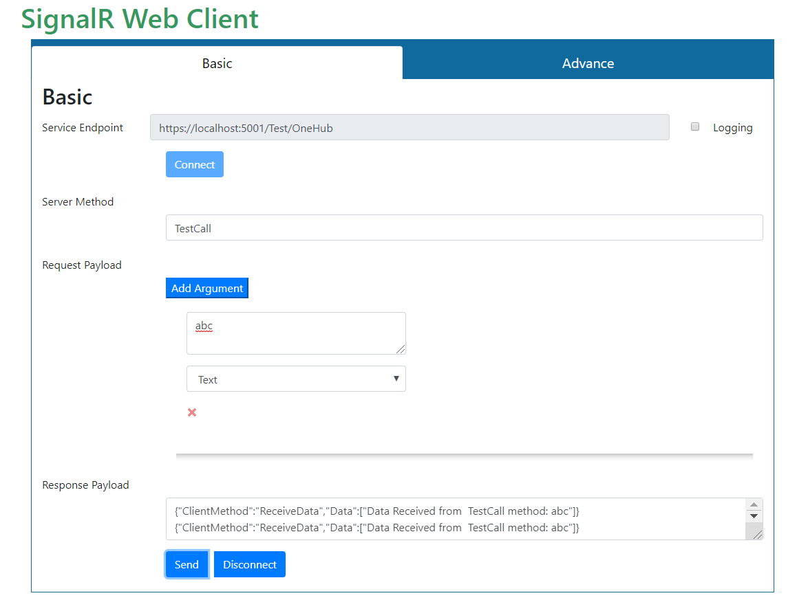
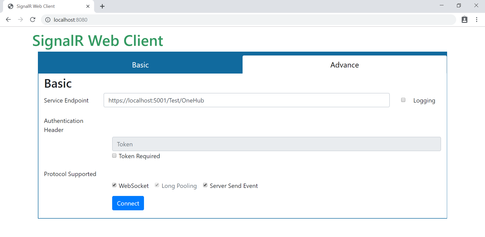

SignalR-Web-Client
======================
This is a JavaScript based SignalR Web Client.

It is a debugging tool to test ASP.Net Core SignalR hubs. This is a UI based SignalR client. Using this tool, we can send the data to the SignalR hub and receive the response from the SignalR Hub. This tool is design for dotnetcore developer to make their life easier when they will work with SignalR.

<p align="center">
  
  <br>
</p>

*Table of Contents*


- [SignalR-Web-Client](#signalr-web-client)
- [Prior Knowledge:](#prior-knowledge)
- [Prerequisite](#prerequisite)
- [Install](#install)
- [How it works?](#how-it-works)
    - [Baisc View](#baisc-view)
      - [Server Method:](#server-method)
      - [Request Payload:](#request-payload)
      - [Data Type supports:](#data-type-supports)
    - [Advance View](#advance-view)
    - [Reporting Issues](#reporting-issues)
  - [How to integrate?](#how-to-integrate)
- [Technologies](#technologies)
- [Browser Support](#browser-support)
- [License](#license)


# Prior Knowledge:

Before using this tool, you should be know about:

- [What is Asp.Net Core?](https://dotnet.microsoft.com/learn/aspnet/what-is-aspnet-core)
- [What is SignalR in Asp.Net Core?](https://docs.microsoft.com/en-us/aspnet/core/signalr/introduction?view=aspnetcore-3.0)

# Prerequisite

- Node.Js
- Npm
- Git

# Install

SignalR Web Client is available [here](https://gourav-d.github.io/SignalR-Web-Client/dist/).

To setup in local enviornment:

1. Clone repository.<br/>
   Open cmd and run the below command:
    ```
    git clone "https://github.com/gourav-d/SignalR-Web-Client.git"
    ```
2. Once the cloning is completed, go to "SignalR-Web-Client" folder.
   ```
   cd SignalR-Web-Client
   ```
3. The **tool need to be run under some server**. This is one of the requirement of SignalR library. So, if you already have a running server, then copy the content of "SignalR-Web-Client\dist" folder and put it on your server.<br/>
   If you don't have server or wants to run the tool in different server, no worry.<br/>
  Will tell you two approches to run this tool.
     1.  ***Using http server(npm)*** <br/>
          Here, we will install http-server and then we will host SignalR Web Client(published files) using this server.<br/>
          ```
          npm install http-server -g
          ```
          Then go to "SignalR-Web-Client\dist" folder, and run the below command:<br/>
          ```
          http-server
          ```
          It will start the http-server and host the application. 
          ```
              Starting up http-server, serving ./
              Available on:
              http://192.168.1.5:8080
              http://127.0.0.1:8080
              http://172.18.96.166:8080
              Hit CTRL-C to stop the server
          ```
   
     2. ***Using Webpack Dev Server*** <br/>
          Here, we will not use the published files. Instead, we will build the tool and then run under the webpack dev server.<br/>
          *NOTE*:: If you wants to customize the tool, then you can you this approch.
          ```
          npm install
          npm run dev
          ```
              First, it will install the npm packages, then start the webpack-dev-server and host the application.
          ```
            > signalr-web-client@1.0.0 dev C:\demo\SignalR-Web-Client
            > webpack-dev-server --content-base dist --hot --mode development

            i ｢wds｣: Project is running at http://localhost:8080/
            i ｢wds｣: webpack output is served from /
          ```
4. This step is required if SignalR Web client and Hub server hosted seperately.<br/>
    ex: Hub Server is running on : http://localhost:5001 and <br/>
        SignalR Web client is running on : http://localhost:6001<br/>
    
    In such case, we have to inform the Hub Server, that allow SignalR Web Client (http://localhost:6001) origin.

      ```
      Startup.cs
      
      public void ConfigureServices(IServiceCollection services)
      {
          services.AddCors(options => options.AddPolicy("Cors", builder =>
          {
            builder
              .AllowAnyMethod()
              .AllowAnyHeader()
              .AllowCredentials()
              .WithOrigins("http://localhost:6001");//SignalR Web Client Url
          }));

        ...
      }

      ```

# How it works?

SignalR Web Client have two views:
1. Basic
     - Send data to Hub
     - Listen the hub broadcast messages 
2. Advance
     - Send data to Hub
     - Listen the hub broadcast messages
     - Support token based authentication
     - Support multiple transport type (like *WebSocket, Long Pooling, Server Send Event*)
  
### Baisc View


1. Provide the valid hub url in *Hub Address* textbox.(for ex. https://localhost:5001/Test/OneHub).<br/><br/>


1. Once click on connect button, it will make connection with server. Once the connection is established, if any data is broadcast from the Hub(ex. OneHub) to all the client then, it will be displayed in the response payload section.

2. If we want to call any Hub method. For exmaple TesCall method
```csharp
public class OneHub : Hub
{
    public async Task TestCall(string data)
    {
        var connectionId = Context.ConnectionId;
        await Clients.Client(connectionId).SendAsync("ReceiveData", $"Data Received from  TestCall method: {data}");
    }
}
```
In the tool, we have to pass the parameter.

#### Server Method: 
    TestCall

#### Request Payload:
    It can take multiple parameters. In our example, TestCall method only taking one parameter of type string. 
    ex. TestCall(string data)
        
        Argument textbox  :  Hello
        Data Type         :  Text

#### Data Type supports:
    Currently, the tool supports these data types Text, Number & JSON.


Then click on send button. It will send all the data to the hub. 



### Advance View

It has all the functionality which basic view provides, also it has additional features:
- Authentication Header -> We can you this, when Hub is protected using token based   authentication.
- Transport Type ([To know more about SignalR Transport](https://kevgriffin.com/signalr-transports-explained/)) -> WebSocket, Long Pooling, Server Send Event 
  

 


### Reporting Issues

Nothing is perfect.
- Found an issue?
- Need feature/enhancement

Then, just open a [new clear and descriptive issue](../../issues/new).


## How to integrate?

1. Create a new project.
  File -> New -> Project -> Select "ASP.NET Core Web Application"

2. Now we have to create hub.
    - Create a folder "Hubs". Inside that folder, create a file called "TestHub.cs".


# Technologies

- Aspnet-Signalr 1.1.4
- Bootstrap 4.3.1
- [Mitt](https://github.com/developit/mitt)
- WebComponentsJs 2.2.10

# Browser Support
Currently, it supports only chrome browser.

# License

[MIT License](https://opensource.org/licenses/MIT)

---
Copyright &copy; 2020,
Created by [Gourav Dwivedi](https://github.com/gourav-d).
Released under the terms of the [MIT license](https://github.com/gourav-d/SignalR-Web-Client/blob/master/LICENSE).