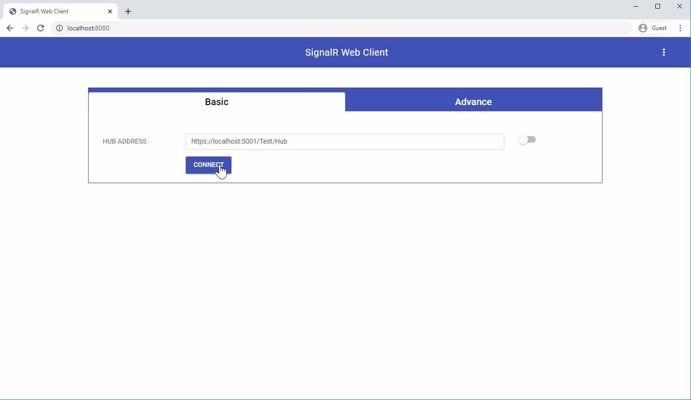

SignalR Web Client
======================

 It is a debugging tool to test ASP.Net Core SignalR hubs. Using this tool, we can send the data to the SignalR hub and receive a response from the SignalR Hub. The tool is designed for DotNet core developers to make their life easier when they will work with SignalR. Developer's, no need to write a single line of code to test the Hub. SignalR Web Client is available [here](https://gourav-d.github.io/SignalR-Web-Client/dist/).

<p align="center">
  
  <br>
</p>

<div align="center" style="width: 1000px; height: 600px;">
    
</div>

<br/><br/><br/>
*Table of Contents*


- [SignalR Web Client](#signalr-web-client)
- [Prior Knowledge](#prior-knowledge)
- [Prerequisite](#prerequisite)
- [Installation](#installation)
- [How it works?](#how-it-works)
    - [Basic View](#basic-view)
      - [Server Method:](#server-method)
      - [Request Payload:](#request-payload)
      - [Data Type supports:](#data-type-supports)
    - [Advance View](#advance-view)
- [Reporting Issues](#reporting-issues)
- [Samples](#samples)
- [Upcoming Features](#upcoming-features)
- [Technologies](#technologies)
- [ASP.Net Core Support](#aspnet-core-support)
- [Browser Support](#browser-support)
- [License](#license)


# Prior Knowledge

Before using this tool, you should know about:

- [What is Asp.Net Core?](https://dotnet.microsoft.com/learn/aspnet/what-is-aspnet-core)
- [What is SignalR in Asp.Net Core?](https://docs.microsoft.com/en-us/aspnet/core/signalr/introduction?view=aspnetcore-3.0)

# Prerequisite

- Node.Js 
- Npm
- Git

# Installation

SignalR Web Client is available [here](https://gourav-d.github.io/SignalR-Web-Client/dist/).

To set up in local environment:

1. Clone repository.<br/>
   Open cmd and run the below command:
    ```
    git clone "https://github.com/gourav-d/SignalR-Web-Client.git"
    ```
2. Once the cloning is completed, go to the "SignalR-Web-Client" folder.
   ```
   cd SignalR-Web-Client
   ```
3. The **tool needs to be run under some server**. This is one of the requirements of the SignalR library. So, if you already have a running server, then copy the content of "SignalR-Web-Client\dist" folder and put it on your server.<br/>
   If you don't have a server or wants to run the tool in a different server, no worry.<br/>
  Will tell you two approaches to run this tool.
     1.  ***Using http server(npm)*** <br/>
          Here, we will install http-server and then we will host SignalR Web Client(published files) using this server.<br/>
          ```
          npm install http-server -g
          ```
          Then go to "SignalR-Web-Client\dist" folder, and run the below command:<br/>
          ```
          http-server
          ```
          It will start the http-server and host the application. 
          ```
              Starting up http-server, serving ./
              Available on:
              http://192.168.1.5:8080
              http://127.0.0.1:8080
              http://172.18.96.166:8080
              Hit CTRL-C to stop the server
          ```
   
     2. ***Using Webpack Dev Server*** <br/>
          Here, we will not use the published files. Instead, we will build the tool and then run under the webpack dev server.<br/>
          *NOTE*:: If you want to customize the tool, then you can you this approach.
          ```
          npm install
          npm run dev
          ```
              First, it will install the npm packages, then start the webpack-dev-server and host the application.
          ```
            > signalr-web-client@1.0.0 dev C:\demo\SignalR-Web-Client
            > webpack-dev-server --content-base dist --hot --mode development

            i ｢wds｣: Project is running at http://localhost:8080/
            i ｢wds｣: webpack output is served from /
          ```
4. This step is required if SignalR Web client and Hub server hosted separately.<br/>
    ex: Hub Server is running on http://localhost:5001 and <br/>
        SignalR Web client is running on : http://localhost:8080<br/>
    
    In such a case, we have to inform the Hub Server, that allows SignalR Web Client (http://localhost:8080) origin.

```csharp
Startup.cs

public void Configure(IApplicationBuilder app, IHostingEnvironment env)
{
    ...
    //CORS: This required when SignalR Web client is hosted on different server
    app.UseCors("Cors");
    ...
    app.UseSignalR(option => {
        //You'r Hub
        //option.MapHub<SampleHub>(new PathString("/Test/Hub"));
    });
}

public void ConfigureServices(IServiceCollection services)
{
    //CORS: This required when SignalR Web client is hosted on different server
    services.AddCors(options => options.AddPolicy("Cors", builder =>
    {
      builder
        .AllowAnyMethod()
        .AllowAnyHeader()
        .AllowCredentials()
        .WithOrigins("http://localhost:8080"); //SignalR Web Client Url
    }));

    ...
    services.AddSignalR();

  ...
}
```
refer this [Startup.cs file](https://github.com/gourav-d/SignalR-Web-Client/blob/master/Samples/AspDotCore/WebApp/WebApp/Startup.cs#L30)
      

# Run SignalR Web Client using Docker
```
$ docker pull gourav5/signalr-web-client

$ docker run -it -d -p 8080:80 gourav5/signalr-web-client
```
Then you can hit http://localhost:8080 or http://host-ip:8080 in your browser.


# How it works?

SignalR Web Client has two views:
1. Basic
     - Send data to Hub
     - Listen to the hub broadcast messages
2. Advance
     - Send data to Hub
     - Listen to the hub broadcast messages
     - Support token-based authentication
     - Support multiple transport type (like *WebSocket, Long Polling, Server Send Event*)
     - Skip Negotiation, this feature only supported when the WebSockets transport is the only enabled transport. This setting can't be enabled when using the Azure SignalR Service.
  
### Basic View


<div align="center" style="width: 1000px; height: 600px;">
    
</div>


1. Provide the valid hub URL in *Hub Address* textbox.(for ex. https://localhost:5001/Test/Hub).

2. Click on the connect button, it will try to connect with the server. Once the connection is established, if any data is broadcast from the Hub(ex. SampleHub) to all the clients then, it will be displayed in the response payload section.

3. If we want to call any Hub method. For example SendMessage method
```csharp
public class SampleHub : Hub
{
    public async Task SendMessage(string data)
    {
        var connectionId = Context.ConnectionId;
        await Clients.Client(connectionId).SendAsync("ReceiveData", $"Data Received from  SendMessage method: {data}");
    }
}
```
In the tool, we have to pass the parameter.

#### Server Method: 
    SendMessage

#### Request Payload:
    It can take multiple parameters. In our example, SendMessage method only takes one parameter of type string. 
    ex. SendMessage(string data)
        
        Argument textbox  :  Hello
        Data Type         :  Text

#### Data Type supports:
    Currently, the tool supports these data types Text, Number & JSON.


4. Then click on the send button. It will send all the data to the hub. 


### Advance View

It has all the functionality which basic view provides, also it has additional features like:
- Authentication Header -> We can use you this when Hub is protected using token-based authentication.
- Skip Negotiation -> This only supported when the WebSockets transport is the only enabled transport. This setting can't be enabled when using the Azure SignalR Service.
- Transport Type ([To know more about SignalR Transport](https://kevgriffin.com/signalr-transports-explained/)) -> WebSocket, Long Polling, Server Send Event 
  

 <div align="center" style="width: 1000px; height: 600px;">
    
</div>


# Reporting Issues

Nothing is perfect.
- Found an issue?
- Need feature/enhancement

Then, just open a [new clear and descriptive issue](../../issues/new).


# Samples

[Samples are available here](https://github.com/gourav-d/SignalR-Web-Client/tree/master/Samples/AspDotCore/WebApp/WebApp)

# Upcoming Features
- Data Streaming Listener
- SignalR Web Client Chrome Extension
- Support for MessagePack Protocol (Currently, it support only JSON Protocol)

# Technologies
- Aspnet-Signalr 1.1.4
- Bootstrap 4.3.1
- [Mitt](https://github.com/developit/mitt)
- WebComponentsJs 2.2.10

# ASP.Net Core Support
Currently, it works well with ASP.Net Core 2.2, 3.0 & 3.1.

# Browser Support
Currently, it supports only the chrome browser.

# License

[MIT License](https://opensource.org/licenses/MIT)

---
Copyright &copy; 2020,
Created by [Gourav Dwivedi](https://github.com/gourav-d).
Released under the terms of the [MIT license](https://github.com/gourav-d/SignalR-Web-Client/blob/master/LICENSE).
